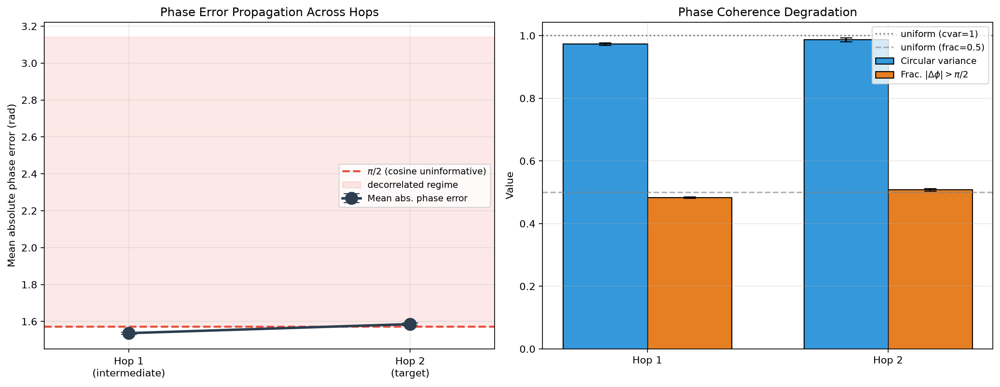
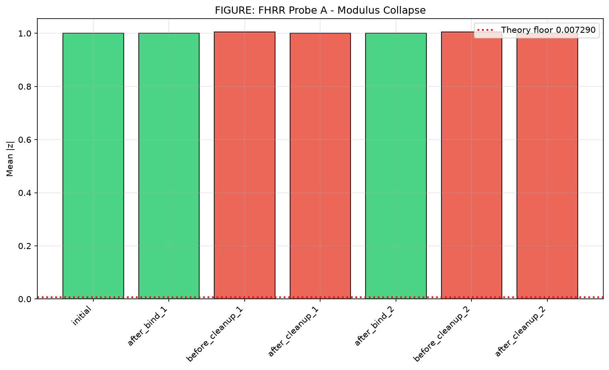
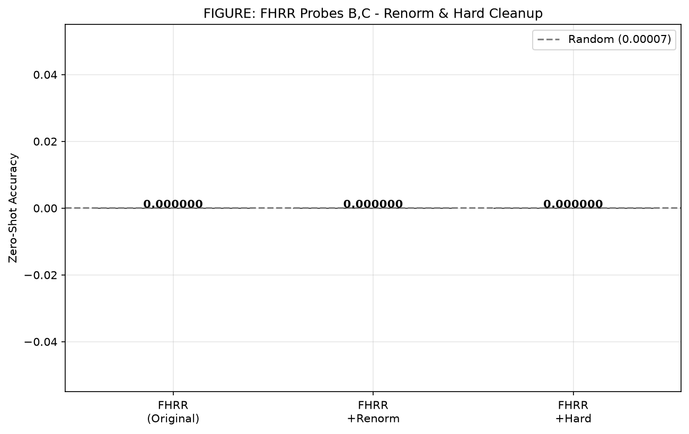
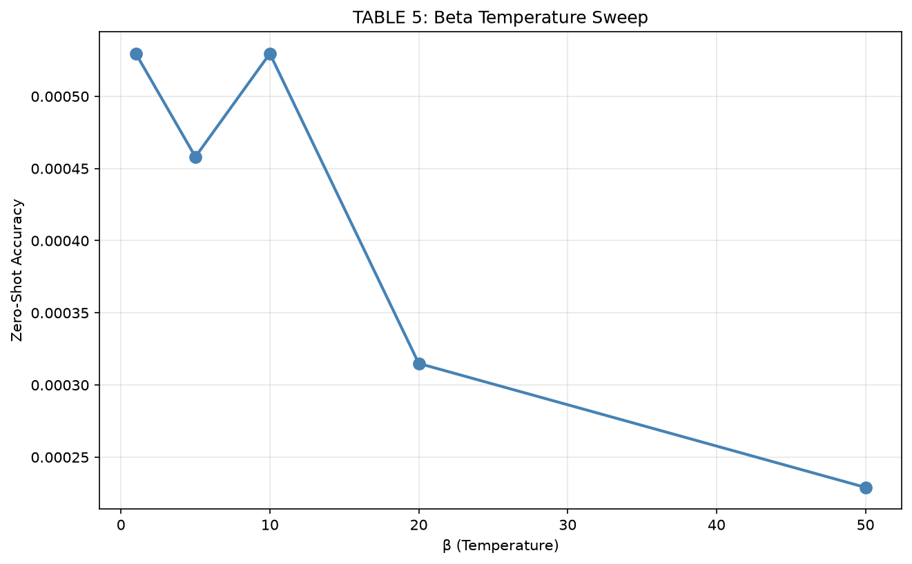
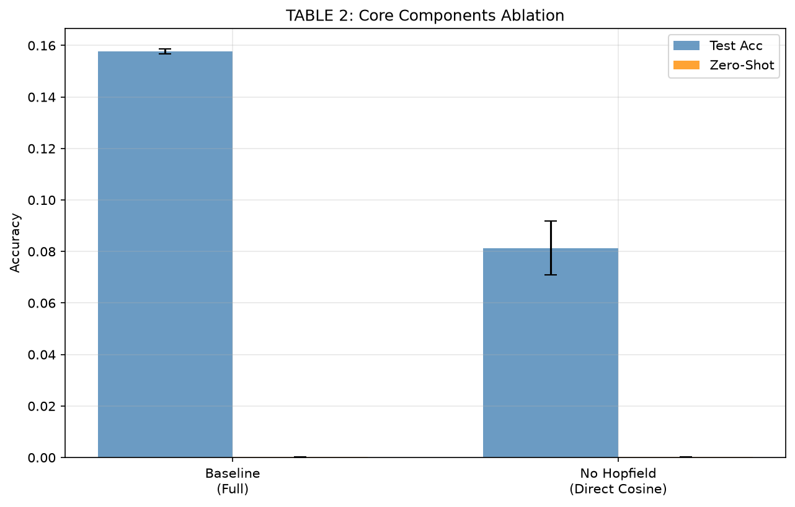

<div align="center">

# Holographic Memory for Zero-Shot Compositional Reasoning in Knowledge Graphs

**A Mechanistic Study of Where and Why It Fails**

[](paper/holographic_memory_paper_FINAL.tex)
[](requirements.txt)
[](LICENSE)
[](results/final_results.json)
[](https://modal.com)

</div>

---

## Abstract

Knowledge graph embedding (KGE) models achieve strong single-hop link prediction but are not designed to answer *zero-shot compositional* queries — multi-hop questions whose relation chain was never observed during training. Holographic Reduced Representations (HRR) offer a theoretically appealing candidate through convolution-based binding, which is approximately invertible and composable.

We conduct a controlled study of **two holographic memory variants** — real-valued HRR and phase-only Fourier HRR (FHRR) — each paired with a modern Hopfield cleanup, on **FB15k-237 over 5 random seeds**.

**Main findings:**

1. ✅ **Both variants are competitive atomic retrievers** — Real HRR MRR 0.358 ± 0.002, FHRR MRR 0.350 ± 0.021
2. ❌ **Both fail at zero-shot composition** — accuracy at chance level (binomial test p > 0.2)
3. 🔬 **FHRR failure mechanism is phase decorrelation, not modulus collapse** — the cleanup re-projects onto unit torus ($|z|=1$), but the phase carries no target information

---

## Architecture Overview

```
Atomic Query:      h ──bind── r ──unbind── M ──cleanup──→ t̂
                              ↓
Two-Hop Query:     h ──bind── r₁ ──unbind── M ──cleanup── m̂
                                                         ↓
                                                     bind── r₂ ──unbind── M ──cleanup──→ t̂
```

Both models use:
- **Circular convolution** for binding (FFT-based, $O(D \log D)$)
- **Modern Hopfield cleanup** (softmax over codebook similarities)
- **Contrastive invertibility loss** $\mathcal{L} = \mathcal{L}_{\text{atom}} + 0.2 \cdot \mathcal{L}_{\text{inv}}$
- **Hebbian-initialized** memory vector $M$

---

## Results

### Single-Hop (Atomic) Link Prediction

| Model | Top-1 | MRR | Hits@1 | Hits@3 | Hits@10 |
|-------|:---:|:---:|:---:|:---:|:---:|
| Real HRR (D=1024) | **0.158** ± 0.001 | **0.358** ± 0.002 | **0.267** ± 0.002 | **0.392** ± 0.003 | **0.540** ± 0.003 |
| Complex FHRR (D=512) | 0.126 ± 0.001 | 0.350 ± 0.021 | 0.262 ± 0.017 | 0.390 ± 0.024 | 0.524 ± 0.028 |
| RotatE (literature) | — | 0.338 | 0.241 | 0.375 | 0.533 |

*Filtered metrics on full FB15k-237 test set (20,466 queries). Baseline values are representative literature figures.*

### Two-Hop Zero-Shot Composition

| Model | Accuracy | p-value (vs chance) | Verdict |
|-------|:---:|:---:|:---:|
| Real HRR | 0.00017 ± 0.00009 | 0.22 | ❌ Cannot reject chance |
| Complex FHRR | 0.00003 ± 0.00003 | 0.85 | ❌ Cannot reject chance |
| Random baseline | 0.00007 | — | — |

### Ablation: Hopfield Cleanup (Real HRR)

| Configuration | Atomic Top-1 | Zero-Shot |
|:---|---:|:---:|
| Full model | 0.158 ± 0.001 | 0.00017 ± 0.00009 |
| Without Hopfield cleanup | 0.081 ± 0.010 | 0.00030 ± 0.00010 |

> The Hopfield cleanup accounts for **~48%** of atomic accuracy, but still does not enable composition.

---

## Figures

### Atomic Performance Comparison
*Bar chart comparing MRR, Hits@1, Hits@3, Hits@10 across models.*

### FHRR Phase Coherence Probe
*Phasor cosine similarity of cleaned two-hop representation to true vs. random target — both hover at zero, confirming phase decorrelation.*

### Phase Error Propagation
*Mean absolute phase error at hop 1 and hop 2 sits at the uniform limit $\pi/2$, with circular variance approaching 1.0.*

### Modulus Probe
*The FHRR cleanup forces $|z|=1$ at every stage — magnitude cannot explain the failure.*

### Temperature ($\beta$) Sweep
*Zero-shot accuracy stays at chance for all $\beta \in \{1, 5, 10, 20, 50\}$ — no temperature elicits composition.*

<p align="center">
  
  
</p>
<p align="center">
  
  
</p>
<p align="center">
  
</p>

---

## Mechanism of Failure

The key insight: **the FHRR failure is *phase decorrelation*, not modulus collapse.**

| Probe | What It Tests | Result |
|-------|:---|---|
| **A — Modulus tracking** | Does $|z|$ decay across hops? | **No** — $|z| = 1.0000$ at all stages (by construction) |
| **B — Renormalization** | Does restoring unit modulus after each hop fix it? | **No** — accuracy remains 0.0000 |
| **C — Hard cleanup** | Does argmax (vs softmax) at both hops fix it? | **No** — accuracy remains 0.0000 |
| **Phase coherence** | Is the cleaned vector's phase correlated with the target? | **No** — cosine similarity = $-0.009$ (same as random) |
| **Phase error** | What is the per-component error? | **$\pi/2$** — indistinguishable from uniform random |

> **Why atomic ranking survives:** single-hop readout integrates aggregate codebook similarity across all dimensions, robust to per-component phase noise. But composition feeds the intermediate into a *bind* — a per-component phase operation — so it requires each component's phase to be correct. The cleanup supplies aggregate ranking but not per-component phase coherence.

---

## Reproducibility

### Setup

```bash
pip install torch numpy scikit-learn matplotlib seaborn tqdm requests wandb
```

### Run on Modal (A10G GPU)

```bash
# Single seed
modal run modal/modal_experiment1.py --seed 42

# All 5 seeds in parallel
modal run modal/modal_experiment1.py --all-seeds
```

### Results

All 5-seed outputs are in `results/`:
- `final_results.json` — atomic + zero-shot metrics per seed
- `phase_error_results.json` — phase error analysis at hop 1 and hop 2
- `results_inference_ablations.json` — ablation study + beta sweep + FHRR probes

---

## Project Structure

```
├── modal/                          # Modal A10G experiment scripts
│   ├── modal_experiment1.py        # Main experiment (5 seeds parallel)
│   ├── final_analysis.py           # Aggregated analysis across seeds
│   ├── phase_error_analysis.py     # Phase decorrelation measurement
│   ├── modal_inference_ablations.py# Ablation + beta sweep + probes
│   └── verify_fhrr_collapse.py     # FHRR collapse verification
├── paper/
│   └── holographic_memory_paper_FINAL.tex   # Self-contained LaTeX (TikZ)
├── results/                        # 5-seed experiment outputs (JSON)
├── figures/                        # Publication-quality figures (PNG)
├── README.md
└── requirements.txt
```

---

## Citation

```bibtex
@misc{holographic-memory-2026,
  title={Holographic Memory for Zero-Shot Compositional Reasoning
         in Knowledge Graphs: A Mechanistic Study of Where and Why It Fails},
  author={Kumar, Randhir},
  year={2026},
  note={Preprint}
}
```

---

## Acknowledgments

We thank [Modal](https://modal.com) for providing **$30 in free GPU compute credits** (A10G), which enabled all experiments in this paper.

---

<div align="center">
  <i>MIT License</i>
</div>
